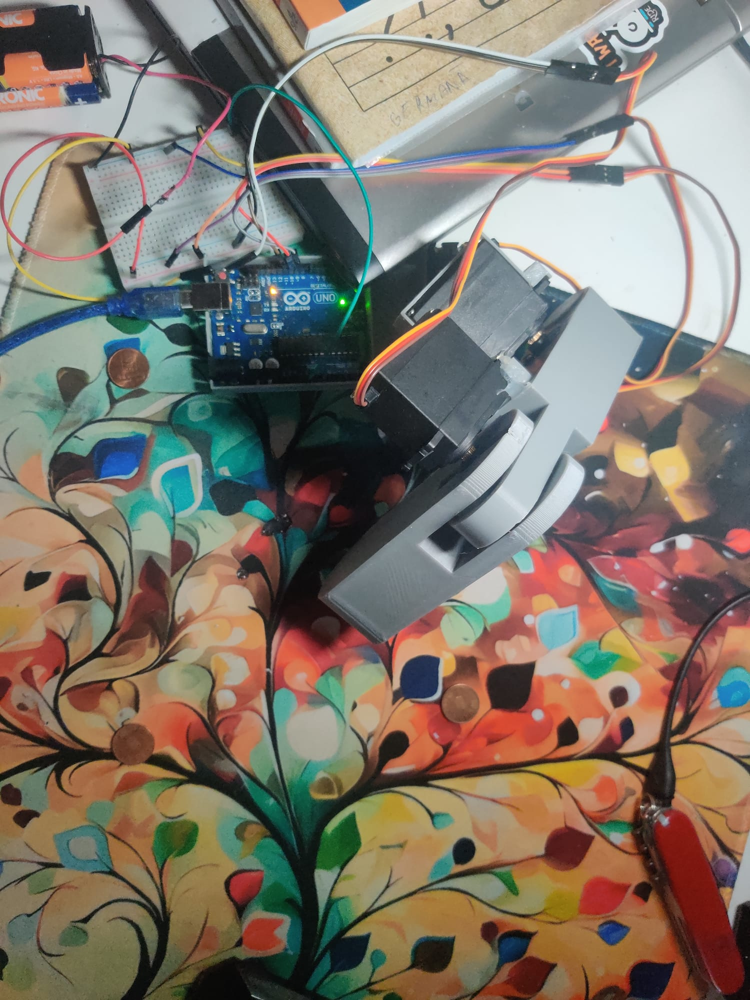
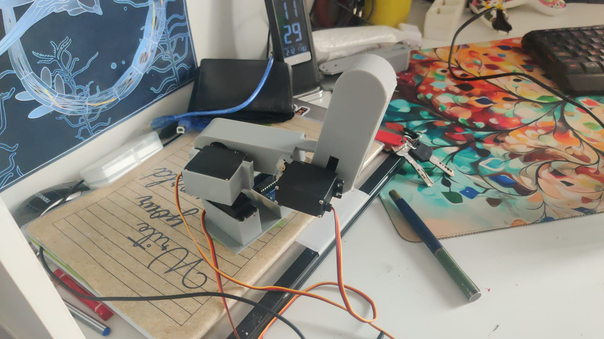

## 3-DOF Robotic Arm: Inverse Kinematics Controller

This project implements a 3-Degree of Freedom (3-DOF) robotic arm control system using an Arduino. 
The firmware translates Cartesian coordinates (X,Y) into joint angles using Inverse Kinematics (IK), allowing the arm to point or reach specific locations on a flat surface.

## Wiring

Servo	       Arduino Pin
Base	       Pin 10
Shoulder	   Pin 9
Elbow	       Pin 11

## Here are some photos and a video

https://github.com/user-attachments/assets/c09e99f6-445a-4035-9639-88cb72344a95
